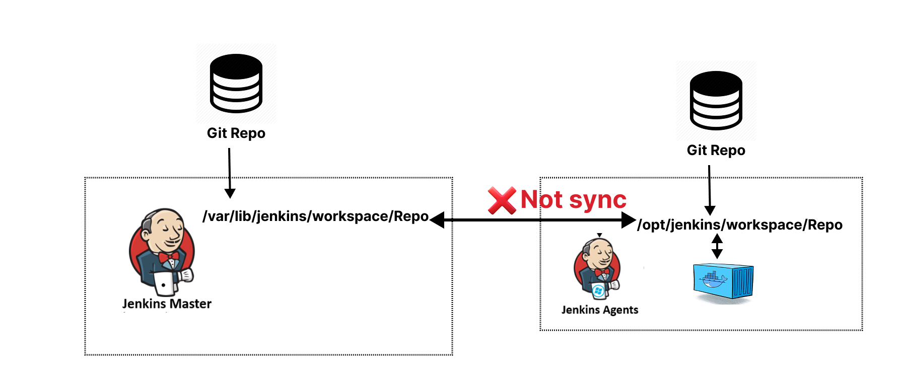

# Jenkins

## features

- **open-source automation server**
- **wide range of plugins**

## Freestyle vs Pipeline as a code

- **Freestyle Jobs**:
  - Traditional way
  - Configuration is done through the UI
  - Suitable for simple tasks.

- **Pipeline as Code**:
  - Repeatable
  - Complex workflows and version control.

## Types of Jenkins Pipelines

### 1. Declarative Pipeline

- Definition: A newer, simpler, and more structured syntax for Jenkins pipelines.
- Syntax: Uses a predefined pipeline {} block.
- Goal: Make pipelines easier to read, write, and maintain.

### 2. Scripted Pipeline

- Definition: Older, more flexible pipeline style written in Groovy code.
- Syntax: Uses node {} blocks and allows full programming logic.
- Goal: Provide full control over pipeline logic.

### jenkins cli

- **Jenkins CLI (Command Line Interface) is a tool that allows you to interact with a Jenkins server from the command line.**

  ```bash
  java -jar jenkins-cli.jar -s http://13.201.95.47:8080 -auth kavindu_gihan:11338a47ede2dc3bcd4b9bd402e48ea1e9 list-jobs
  ```

---

## Triggers in Jenkins

### 1.Source Control Polling in Jenkins

- **Jenkins checks your source code repository at regular intervals to see if there are any changes (new commits, new branches, etc.). If it detects changes, it triggers a build automatically.**

### 2.Webhooks in Jenkins

- **way for external services (like GitHub, GitLab, or Bitbucket) to notify Jenkins automatically when something happens.**
  > Example: You push code to GitHub → GitHub sends a webhook (HTTP POST request) to Jenkins → Jenkins starts a build.
- So instead of Jenkins polling ("check every 5 minutes if repo changed"), the repo pushes an event to Jenkins immediately.
- **👉 This makes builds faster and reduces unnecessary checks.**

### Polling ≠ Webhooks

- Polling: Jenkins repeatedly asks the repo, “Any changes?”
- Webhooks: The repo notifies Jenkins immediately when changes happen. (More efficient, no unnecessary checks.)

### 3.Scheduled Builds in Jenkins

- **Jenkins can be configured to run builds at specific times or intervals.**
- **This is useful for regular tasks like nightly builds or weekly reports.**

### 4.Remote Triggering in Jenkins

- **You can start a Jenkins build remotely using a URL or an API call.**
- **This is useful for integrating Jenkins with other tools or scripts.**

  ```curl -X POST "http://<jenkins-server>:8080/job/<job-name>/build" \
      --user "<username>:<api-token>" \
      -H "Jenkins-Crumb:abcd1234efgh"
  ```

### 5.Build after other projects(Job) are built

- **You can set up a Jenkins job to start building after another job completes.**

---

## Master / Slave Architecture

### Why use Slave (Agent)?

- **Distribute Workload**
- **Different Environments** - Some jobs may require specific OS or software.
- **Isolation**

> 🛑 By default, linux machine do not provide user,password authentication from ssh (so when adding node take this to consideration)

---

## Security in Jenkins

- **Jenkins has a built-in user database for managing users and their permissions.**
- **You can create users, assign roles, and set permissions to control who can do what**

---

## Workspace in Jenkins

- **where the files for a specific job are stored during its execution.**
- **All builds gets of one job share the same workspace unless configured otherwise.**
- **We can clean the workspace before or after the build.**
- **😀 Each node gets its own workspace, each node clones workspace from the git first. There are not shared workspaces between nodes.**

## 

### mvn `<plugin-prefix>:<goal>`

`mvn checkstyle:checkstyle`

- **plugin-prefix**: Short name for a Maven plugin (e.g., `checkstyle`).
- **goal**: Specific task provided by the plugin (e.g., `checkstyle`).

---

## Run stages parallelly

```groovy
pipeline {
    agent any
    stages {
        stage('Parallel Stage') {
            parallel {
                stage('Task 1') {
                    steps {
                        echo 'Executing Task 1'
                        sh 'sleep 5'
                    }
                }
                stage('Task 2') {
                    steps {
                        echo 'Executing Task 2'
                        sh 'sleep 5'
                    }
                }
            }
        }
    }
}
```

## Docker interaction with Jenkins

- **We can use docker plugins in jenkins to interact with docker**

## Docker plugin (alias = Jenkins docker plugin)

- **Purpose** : Provision Jenkins agents (slaves) as Docker containers.
- **Jenkins itself asks Docker:** “Please start a container that will act as a Jenkins agent.”
- 😀 First add docker node in the manage node/cloud section.

```groovy
pipeline {
    agent { label 'docker-agent' }
}
```

## Docker pipeline plugin

- **Purpose** : Run build steps inside Docker within your pipeline.

```groovy
pipeline {
    agent any
    stages {
        stage('Run in Docker Container') {
            agent {
                docker {
                    image 'node:alpine'
                }
            }
            steps {
                sh 'node --version'
            }
        }
    }
}

```

## Syncing Jenkins server workspace with Docker container workspace

```groovy
        docker {
            image 'node:alpine'
            reuseNode true
        }
```

this just use bind mound behind the scene

> $ docker run -t -d -u 111:113 -w /var/lib/jenkins/workspace/first-docker **_-v /var/lib/jenkins/workspace/first-docker:/var/lib/jenkins/workspace/first-docker:rw,z_** -v /var/lib/jenkins/workspace/first-docker@tmp:/var/lib/jenkins/workspace/first-docker@tmp:rw,z -e

### Here’s the behind-the-scenes

> Jenkins runs docker run ... <image> cat

- Notice the cat at the end? That’s how Jenkins “keeps the container alive”.
- This overrides the image’s CMD and ENTRYPOINT. (Most official images used in CI/CD (like node, playwright, alpine, ubuntu) do not define an ENTRYPOINT.)
  -The container just sits there with a cat process running.
- Jenkins then executes your sh commands inside that running container with docker exec.

> docker exec <container> sh -c "npm ci && npm test"

---

## Secrets and Credentials in Jenkins

- **We can store sensitive information (like passwords, API tokens, SSH keys) securely in Jenkins using the Credentials plugin.**

- access credentials in pipeline

```groovy
  environment{
        NETLIFY_AUTH_TOKEN=credentials('netlify -token')
  }
```

```groovy
  withCredentials([string(credentialsId: 'netlify -token', variable: 'NETLIFY_AUTH_TOKEN')]) {
        sh 'echo $NETLIFY_AUTH_TOKEN'
  }
```

---

## Passing Data between stages in Jenkins

- **We can use environment variables or files to share data between stages.**

```groovy
pipeline {
    agent any
    environment {
        MY_VAR = ''
    }
    stages {
        stage('Set Variable') {
            steps {
                script {
                    MY_VAR = 'Hello, World!'
                }
            }
        }
        stage('Use Variable') {
            steps {
                echo "MY_VAR is: ${MY_VAR}"
            }
        }
    }
}
```

---

## Basic plugins in Jenkins

- **Git plugin**: Integrates Git with Jenkins.
- **GitHub plugin**: Integrates GitHub with Jenkins.
- **Pipeline plugin**: Enables Jenkins Pipeline as code.
- **Docker plugin**: Allows jenkins to provision agents as docker containers.
- **Docker pipeline plugin**: Run build steps inside Docker within your pipeline.
- **Blue Ocean plugin**: Modern UI for Jenkins Pipelines.
- **Stage View plugin**: Visualize pipeline stages.
- **Publish Over SSH plugin**: Transfer files via SSH.
- **SonarQube Scanner for Jenkins**: add sonarqube server
- **Matrix Authorization Strategy plugin**: Fine-grained access control.
- **SSH Build Agents plugin**: Use SSH to connect to remote build agents.

---

### How 3rd party software be use

- **we can install them in the os and give their path**
- **we can tell jenkins the version and jenkins will download and use them when the job runs**
- **we can tel jenkins the url to download the software and jenkins download when the job runs**

🔥 Modern Best Practice (Important)

Most modern Jenkins pipelines avoid all 3 methods by using:

- 🐳 Docker

```groovy
agent {
    docker {
         image 'node:20-alpine'
    }
}
```
