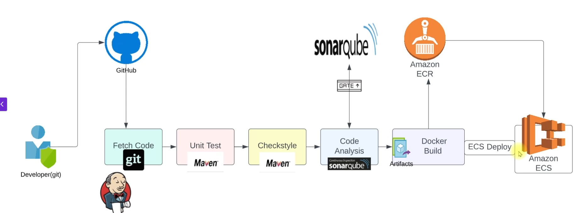

# CI with Jenkins

## Docker interaction with Jenkins

- **We can use docker plugins in jenkins to interact with docker**

## Docker plugin (alias = Jenkins docker plugin)

- **Purpose** : Provision Jenkins agents (slaves) as Docker containers.
- **Jenkins itself asks Docker:** “Please start a container that will act as a Jenkins agent.”
- 😀 First add docker node in the manage node/cloud section.

```groovy
pipeline {
    agent { label 'docker-agent' }
}
```

## Docker pipeline plugin

- **Purpose** : Run build steps inside Docker within your pipeline.

```groovy
pipeline {
    agent any
    stages {
        stage('Run in Docker Container') {
            agent {
                docker {
                    image 'node:alpine'
                }
            }
            steps {
                sh 'node --version'
            }
        }
    }
}

```

## Syncing Jenkins server workspace with Docker container workspace

```groovy
        docker {
            image 'node:alpine'
            reuseNode true
        }
```

this just use bind mound behind the scene

> $ docker run -t -d -u 111:113 -w /var/lib/jenkins/workspace/first-docker **_-v /var/lib/jenkins/workspace/first-docker:/var/lib/jenkins/workspace/first-docker:rw,z_** -v /var/lib/jenkins/workspace/first-docker@tmp:/var/lib/jenkins/workspace/first-docker@tmp:rw,z -e

## SonarQube Integration with Jenkins

- **We use sonar scanner to scan the code and send the report to sonarqube server**
- **Also we can use sonarqube plugin in jenkins to do the same task**
- **After scanning we can see the report in sonarqube server**

### Sonarqube Quality Gates

- **Quality Gates are a set of conditions that your code must meet to be considered acceptable.**
- **sonarqube use web hooks to notify jenkins about the quality gate status**

  > `http://<jenkins-url>/sonarqube-webhook/ `

---


```
