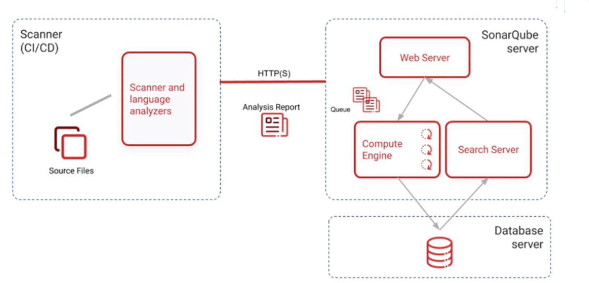

# SonarQube

### SonarQube is a static code analysis tool.

### Static Code Analysis

**Static code analysis is the process of examining source code without executing it, aiming to identify potential bugs, vulnerabilities, and code smells.**

Modern static analysis tools, like SonarQube, provide capabilities beyond basic style and bug detection. They can identify:

1. Security vulnerabilities (e.g., OWASP Top 10)
2. Code smells and technical debt
3. Code duplications and complexity
4. Test coverage issues

### Features

- **Code Quality Gates**
- **Dashboards & Reports**
- **Security Vulnerability Detection**
- **Pull Request Decoration**
- **Support for Plugins**

### What is Dynamic Code Analysis?

- **Dynamic code analysis involves examining a program during its execution.**
- It helps identify **runtime errors, performance bottlenecks, and real-world behavior issues** that static analysis may miss.

## 🔍 SonarQube Client-Server Interaction

SonarQube uses a **client-server architecture** to analyze and manage code quality:

- **Server** → Hosts the web UI, stores analysis results, and enforces quality gates.
- **Clients** → Tools like **SonarScanner**, CI/CD systems (Jenkins, GitLab CI, Azure DevOps), or IDE plugins (**SonarLint**) trigger analysis and send reports.

### 🛠️ Workflow

1. Project is configured on the SonarQube server (with project key & token).
2. A client (scanner/CI job) analyzes the source code.
3. Analysis results are sent via HTTP(S) to the server.
4. The server processes findings (bugs, vulnerabilities, code smells, coverage, duplications).
5. Results are displayed in the SonarQube web UI for developers and stakeholders.
6. CI pipelines can enforce **quality gates**, failing builds if criteria aren’t met.

✅ This ensures continuous feedback on **code quality, security, and technical debt** during development.

### Architecture

## Rules

- SonarQube uses a set of predefined rules to analyze code.
- Each rule has a severity level (e.g., Blocker, Critical, Major, Minor, Info).

## Quality Profiles

- A Quality Profile is a collection of rules that define the coding standards for a specific language.

## Rules vs Quality Profiles

- A rule is a single coding guideline or check.
- A quality profile is a collection of rules applied to a specific language.
- Example:
  - A “Java Quality Profile” may include 500 active Java rules.
  - A “Python Security Profile” may include only rules related to vulnerabilities.

## Quality Gates

- A Quality Gate is a set of conditions that a project must meet to be considered of acceptable quality.
