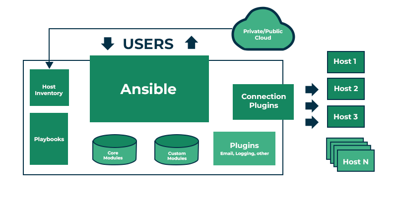

# Ansible

- **Simple** - human-readable automation
- **Many usecases** - provisioning, configuration management, application deployment, orchestration, network automation
- **Agentless** - no need to install agents (ansible) on target machines
  - Uses SSH for communication for linux/unix
  - Uses WinRM for communication for Windows

## Configuration file

- config file with location precedence:

      - ANSIBLE_CONFIG (environment variable if set)
      - ansible.cfg (in the current directory)
      - ~/.ansible.cfg (in the home directory)
      - /etc/ansible/ansible.cfg

## Inventory

- list of nodes or hosts that are managed by Ansible

## inventory parameters

- ansible_host - specify the hostname or IP address to connect to
- ansible_user - specify the username to use for SSH connection
- ansible_port - specify the SSH port to connect to
- ansible_ssh_private_key_file - specify the path to the SSH private key file for authentication
- ansible_connection - specify the connection type (e.g., ssh, winrm, local)

```ini
# Sample Inventory File

# Web Servers
web_node1 ansible_host=web01.xyz.com ansible_connection=winrm ansible_user=administrator ansible_password=WinPass
web_node2 ansible_host=web02.xyz.com ansible_connection=winrm ansible_user=administrator ansible_password=WinPass
web_node3 ansible_host=web03.xyz.com ansible_connection=winrm ansible_user=administrator ansible_password=WinPass

# DB Servers
sql_db1 ansible_host=sql01.xyz.com ansible_connection=ssh ansible_user=root ansible_ssh_pass=LinPass
sql_db2 ansible_host=sql02.xyz.com ansible_connection=ssh ansible_user=root ansible_ssh_pass=LinPass

[db_nodes]
sql_db1
sql_db2

[web_nodes]
web_node1
web_node2
web_node3

[boston_nodes]
sql_db1
web_node1

[dallas_nodes]
sql_db2
web_node2
web_node3

[us_nodes:children]
boston_nodes
dallas_nodes
```

### Inventory formats

- INI - default format
  - use for simple inventories

```ini
[webservers:children]
webservers_us
Webservers_eu

[webservers_us]
server1_us.com ansible_host=192.168.8.101
server2_us.com ansible_host=192.168.8.102

[webservers_eu]
server1_eu.com ansible_host=10.12.0.101
server2_eu.com ansible_host=10.12.0.102
```

- YAML
  - use for complex inventories

```yaml
all:
  children:
    webservers:
    children:
        webservers_us:
        hosts:
            server1_us.com:
                ansible_host: 192.168.8.101
            server2_us.com:
                ansible_host: 192.168.8.102
        webservers_eu:
        hosts:
            server1_eu.com:
                ansible_host: 10.12.0.101
            server2_eu.com:
                ansible_host: 10.12.0.102

```

### architecture



### order in which Ansible looks for its configuration file

1. /etc/ansible/ansible.cfg (system-wide config)
2. ~/.ansible.cfg (user-specific config)
3. ./ansible.cfg (project-specific config)
4. ANSIBLE_CONFIG environment variable

task - application of a module to perform a specific unit of work
play - sequence of tasks to be applied, in order, to one or more hosts selected from your inventory
playbook - text file containing a list of one or more plays to run in a specific order
role - way of automatically loading certain vars_files, tasks, and handlers based on a known file structure

```

```
