# Monitoring and Observability

## Layers of Monitoring

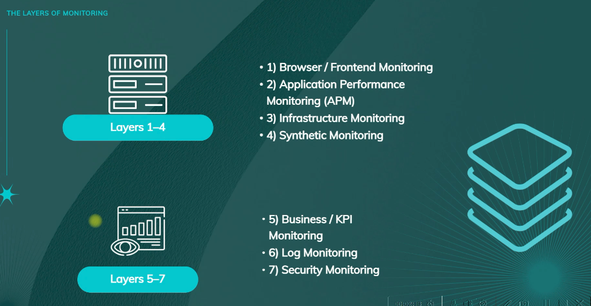

### 1. Browser / Frontend Monitoring

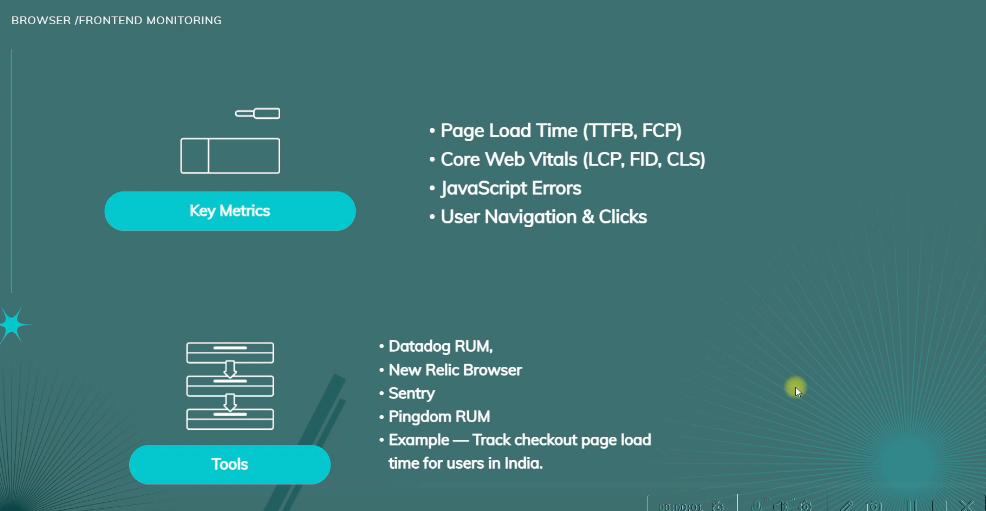

### 2. Application / Backend Monitoring

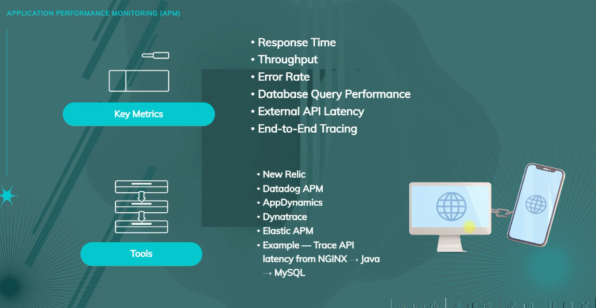

### 3. Infrastructure Monitoring

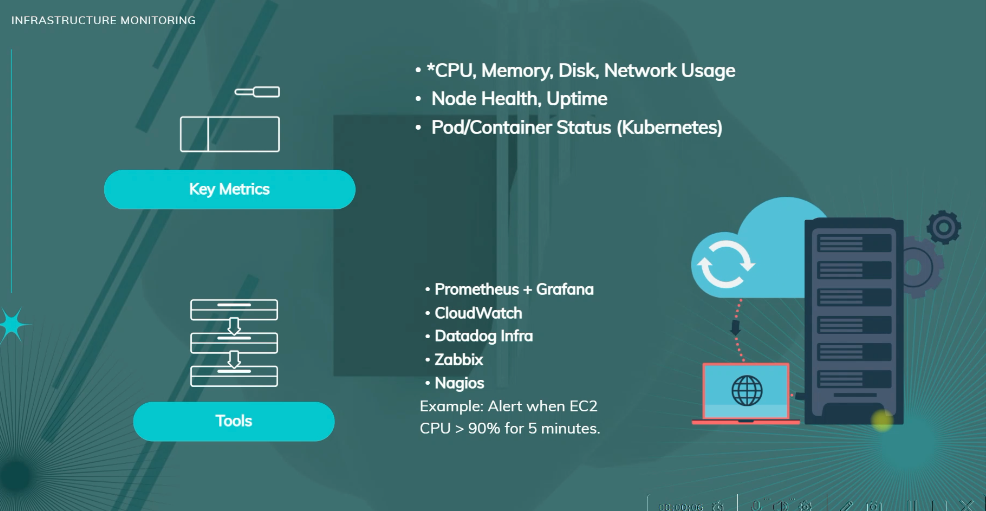

### 4. Synthetic Monitoring

### 5. Business / KPI Monitoring

### 6. Log Monitoring

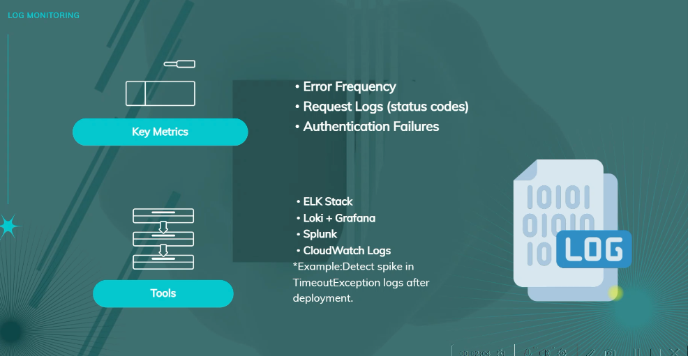

### 7. Security Monitoring

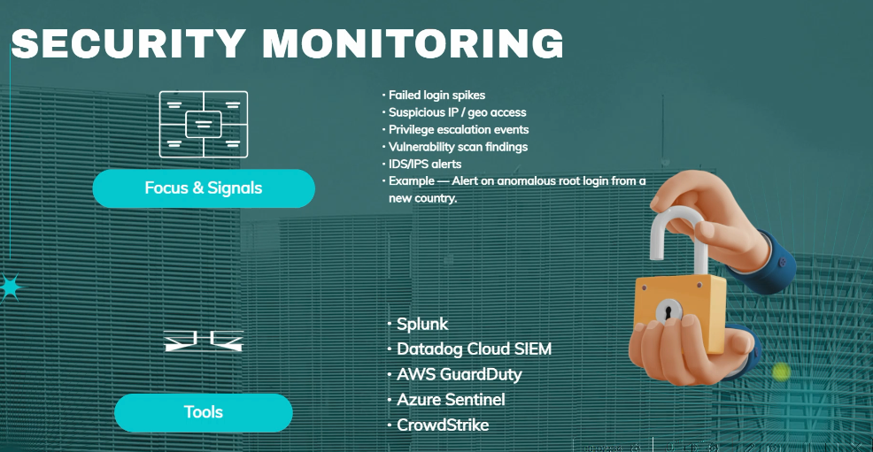

---

## Pillars of Observability

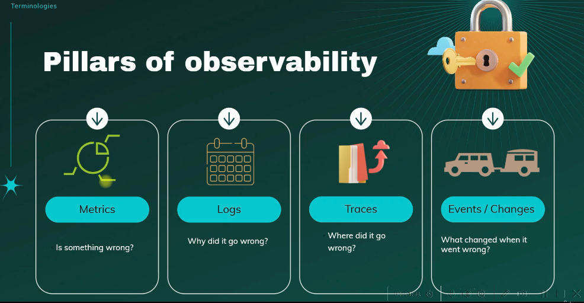

## The 4 Golden signals

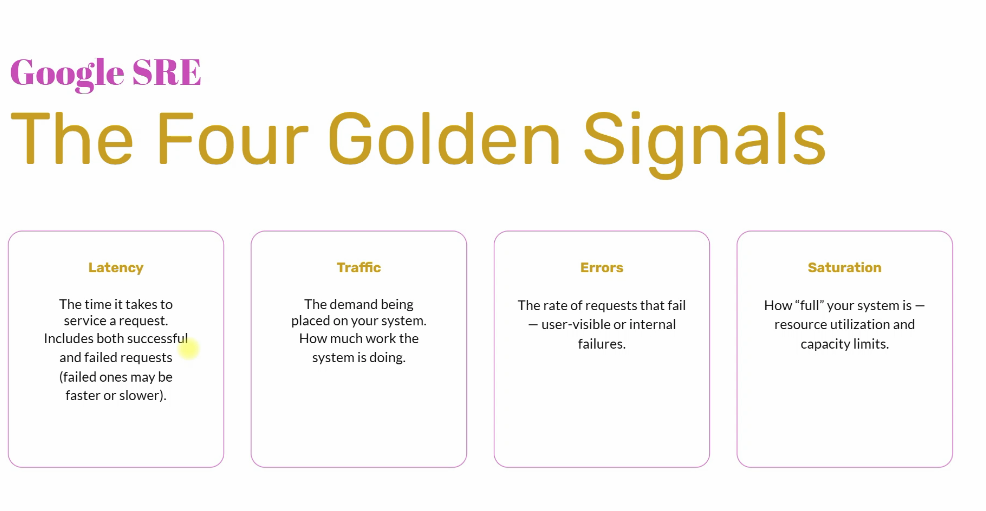

## Prometheus

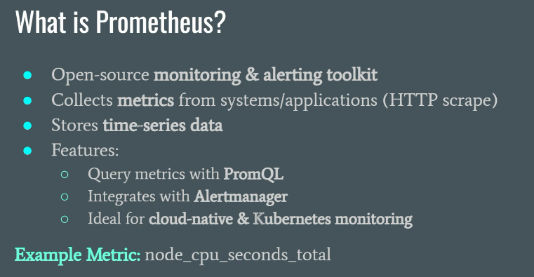

## Grafana

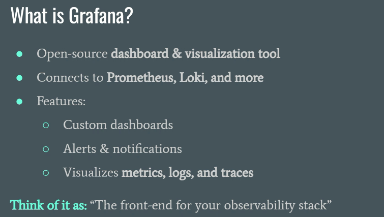

## Loki

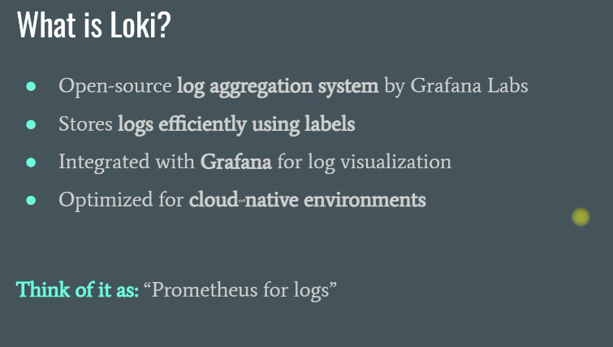

## Node Exporter

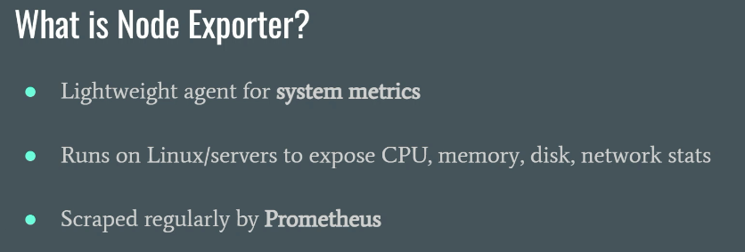

## Alloy

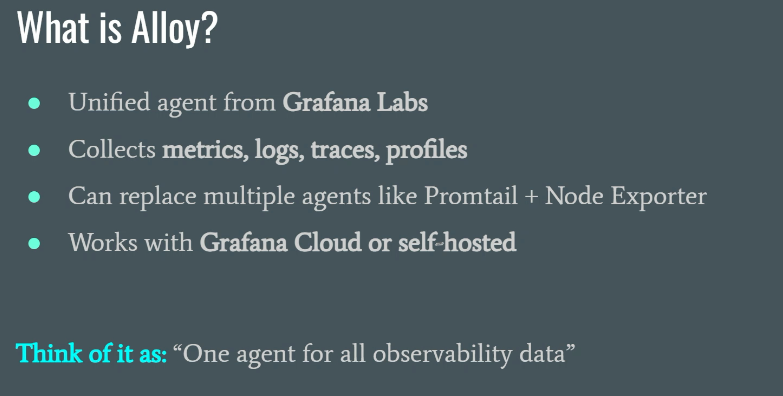

## Alert manager

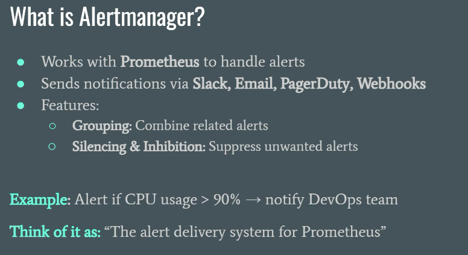

## All in one

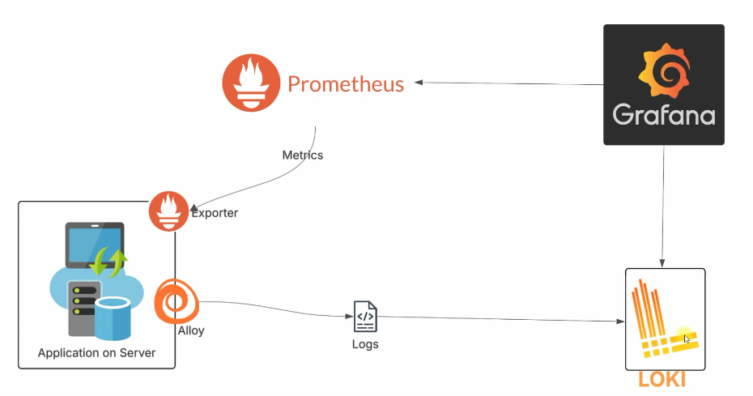

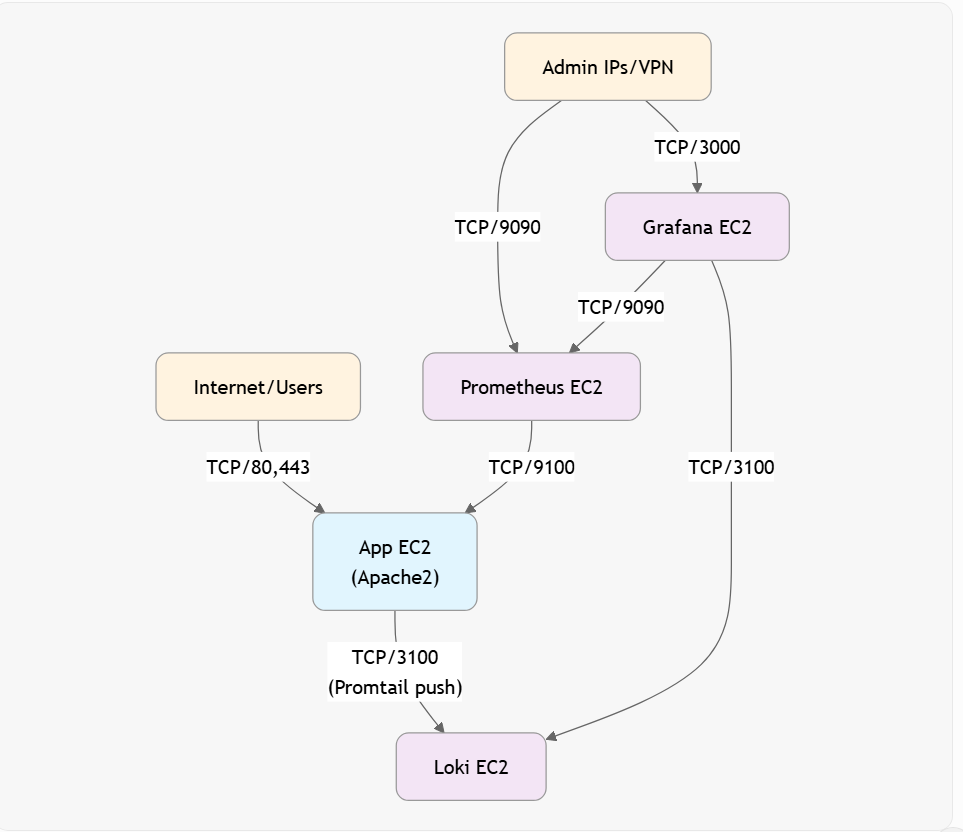
